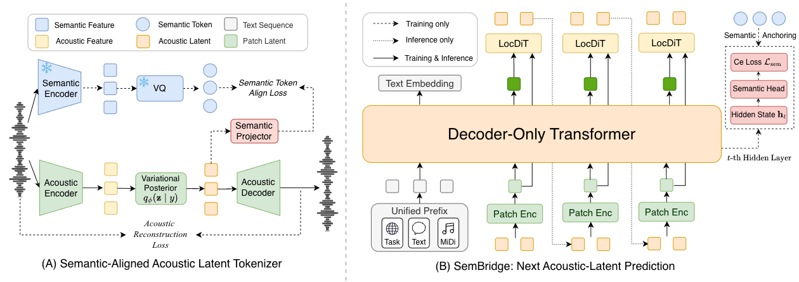

<div align="center">
  <h1>
    SemBridge: Semantic Token Anchoring for Continuous-Latent Autoregressive Speech Generation
  </h1>

  <p align="center">
    
    <a href="https://arxiv.org/pdf/2608.07462"></a>
    <a href="https://tiamojames.github.io/SemBridge_Demo/"></a>
    <a href="LICENSE"></a>
  </p>

  <!-- <p align="center">
    <i>Semantic-token anchoring for continuous-latent autoregressive speech generation.</i>
  </p> -->
</div>

## 📖 Introduction

SemBridge is a semantic-token anchoring framework for continuous-latent autoregressive speech generation. It uses a shared semantic tokenizer to supervise autoregressive LM states with discrete semantic tokens and align continuous acoustic latents, improving linguistic fidelity while maintaining high-quality continuous speech generation. For more details, please refer to our paper.
<div align="center">
  
</div>

## 🚀 News

- **[2026-08]**: Released the [arXiv paper](https://arxiv.org/pdf/2608.07462).

## 📝 Citation

If you find SemBridge useful in your research, please consider citing our paper:

```bibtex
@article{xie2026sembridge,
  title={SemBridge: Semantic Token Anchoring for Continuous-Latent Autoregressive Speech Generation},
  author={Xie, Hanke and Lin, Haopeng and Qian, Jiale and Guo, Dake and Jiang, Yuepeng and Wang, Zhichao and Cao, Wenxiao and Hu, Jingbin and Ma, Guobin and Li, Wenhao and others},
  journal={arXiv preprint arXiv:2608.07462},
  year={2026}
}
```

## ⚠️ Responsible Use

Please obtain consent before using a reference voice and clearly disclose synthetic media where appropriate. Do not use this project for impersonation, fraud, harassment, or deceptive content.

## 📜 License

The code in this repository is released under the [Apache-2.0 License](LICENSE).

Model weights, tokenizer assets, datasets, and third-party components will follow their respective license terms when released.
